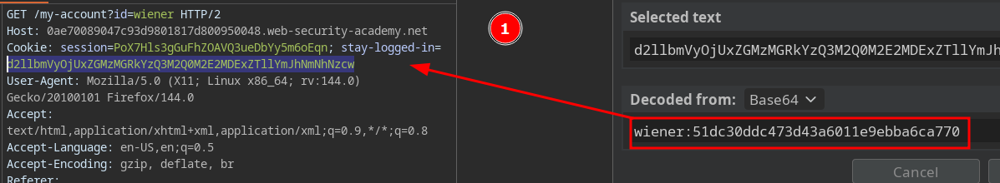
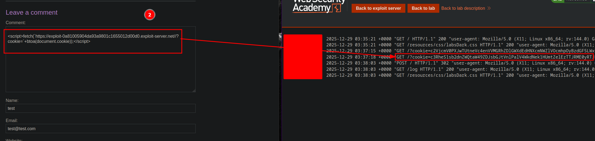
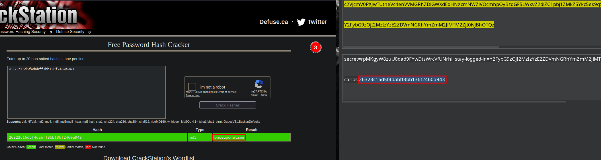

# Offline password cracking

First, we discovered that the cookie follows a specific structure: Base64 encoding of the username, followed by a colon (:) and the MD5 hash of the password.

We look for a XSS vulnerability on the website to exfiltrate the victim's session cookie:

Finally, we decode the Base64 cookie and use tools such as CrackStation to crack the hash and retrieve the plaintext value:

